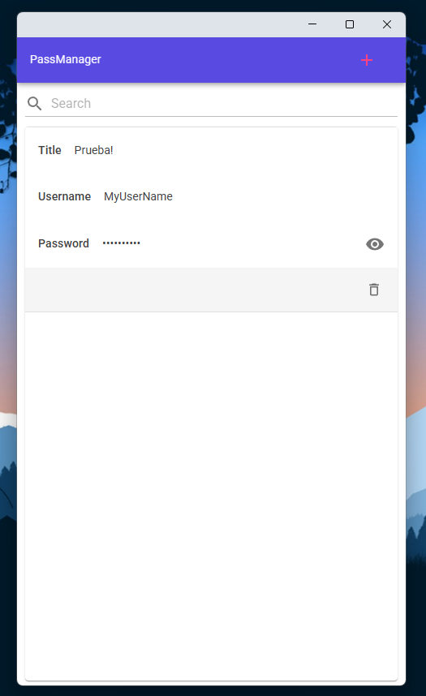

# PassManager

Multiplatform app done with MAUI Blazor Hybrid to manage credentials.

- Suppoorts both Windows and Android
- Data is stored locally with encryption
- Uses Blazor for it's UI (MudBlazor)

